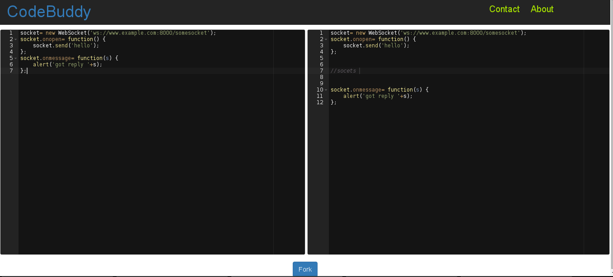

Real-Time code and document + Paste pad
+++++++++++++++++++++++++++++++++++++++++++

About
+++++++++

**CodeBuddy** is a real time code and document collaboration web app. It can be used for real time collaboration. While developing a project many a times developers need help from their peer, teacher or any other person who is more experienced. At that time the CodeBuddy can be used to collaborate. Similary many a times a common document pad is required for shring some information, facts, story, etc... There is a docpad which offers these fascility. 
The code pad offers the syntax highlighting facility using Ace code highlighter. Docpad shows who are online.

Neither your code nor document is saved in database. So, codes can be shared privately and without any worry of code or any other information getting leaked.

When user wants to save codes, notes or some other docs a paste pad can be created. This paste pad is similar to Fedora fpaste, pastepad.org, Github gist etc. 

Once you paste the text, it is saved in database permanently. It is a secure way to save data and share important textual data. As, the pasted information is permannet and can't be modified.

Technical specification
+++++++++++++++++++++++++

* Created using Flask-Python, Fask-socketio, Javascript, Jquery, Bootstrap, CSS, HTML. 

* Extensive use of jquery and flask sockets.

* Database: MongoDB 

Screenshots
++++++++++++

